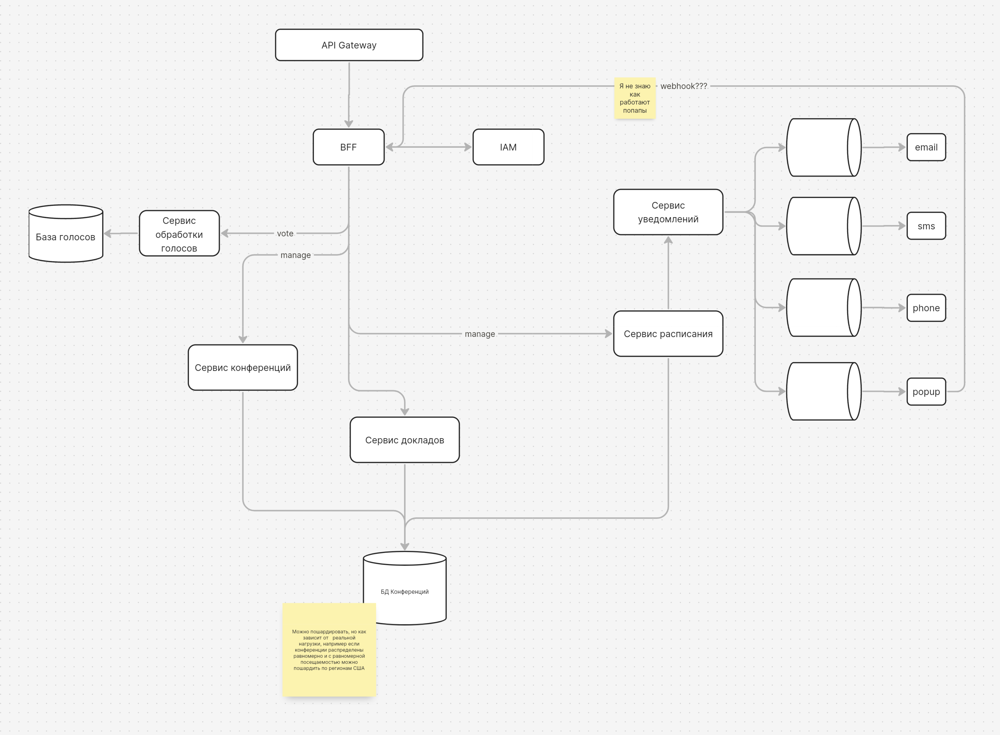

# Задание
Что должно быть в решении:
- проработайте бизнес-возможности (выделите акторов, сущности и действия) отрисуйте их взаимосвязи и сгруппируйте
- в произвольном формате, например C4 Component, отрисуйте компоненты вашей системы
- отпишите точки роста системы (где как вам кажется могут возникнуть проблемы и как их возможно решить)
- (опционально) опишите технологический стэк и мотивируйте его выбор

# Ката

All Stuff, No Cruft

Conference organizer needs a management system for the conferences he runs for both speakers and attendees

- Users: hundreds of speakers, dozens of event staff, thousands of attendees
- Requirements:
    - attendees can access speaking schedule online, including room assignments
    - speakers can manage talks (enter, edit, modify)
    - attendees 'vote up/down' talks
    - organizer can notify attendees of schedule changes up-to-the-minute (if attendees opt in)
    - each conference (being a different subject) can be branded independently
    - speaker slides are accessible online only to attendees
    - evaluation system via web page, email, SMS, or phone
- Additional Context:
    - Conference runs across the US.
    - Very small support staff.
    - 'Bursty' traffic: extremely busy when conference is occurring.
    - Conference organizer wants to easily 'skin' the site for different technology offerings.

----
Так как в требованиях staff не упоминается, дальше пердпологается, что staff == orgonizer

# Решение

## Бизнес возможности
### Акторы:
- Staff
- Speaker
- Attende

### Сущности:
- Conference
- Talk
- Vote
- Notification
- Scheudle

### Действия:

## Компоненты системы

